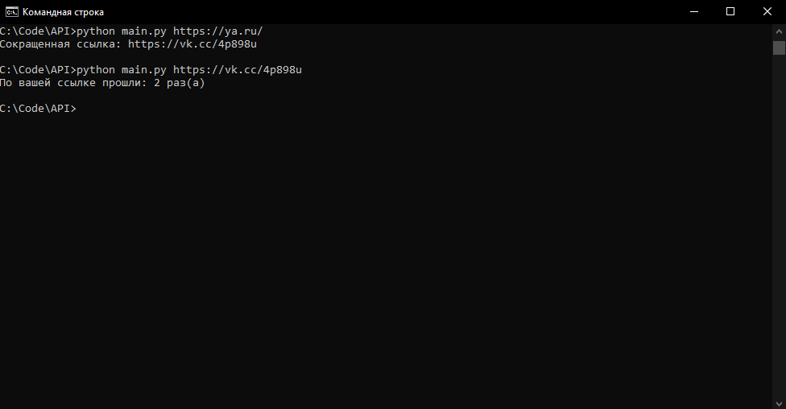
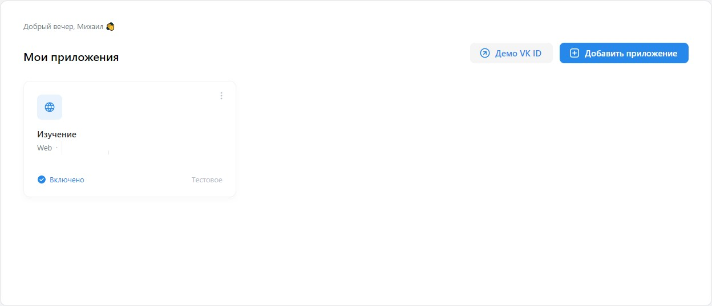
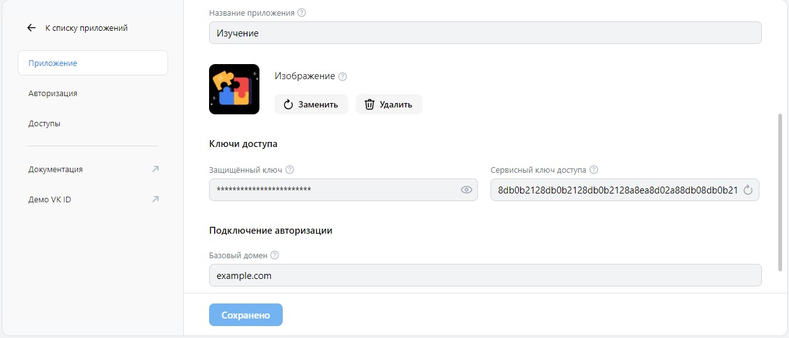
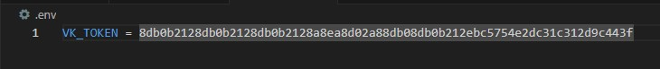

# Сокращение и вывод статистики URL с помощью VK_API

В данном проекте вы можете сократить ссылку, а также посмотреть статистику сокращенной ссылки, прямо из командной строки.



## Как установить

### VK_TOKEN

Чтобы программа заработала, вам потребуеться ``` VK_TOKEN ```, его вы сможете взять перейдя по ссылке [''Сервисный токен приложения''](https://id.vk.com/about/business/go/docs/ru/vkid/latest/vk-id/tokens/service-token).

Перейдя по ссылке нажимаете ''Моё пространство''.
Если у вас нет приложения, создаёте его, вот по этому гайду [''Создание приложения''](https://id.vk.com/about/business/go/docs/ru/vkid/latest/vk-id/connection/create-application)



После создания приложения, нажимаете на своё приложение и попадаете в его настройку. Здесь находите поле с именем ''Сервисный ключ доступа'' и копируете его.



Затем в корневой папки, находите и открываете файл ''.env''.
В этом файле, вставляеете в переменную ```VK_TOKEN```, свой сервисный ключ.



### Используемые библиотеки

Python3 должен быть уже установлен. Затем используйте ```pip``` (или ```pip3```, есть конфликт с Python2) для установки зависимостей:

```pip install -r requirements.txt```
